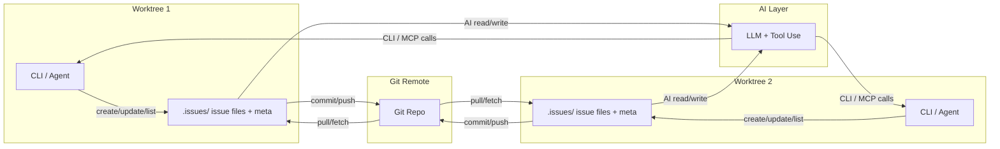

## 一、总体结论（先给方向）

结合你的四个痛点，我建议的路线是：

1. **放弃“单 MD 文件 + 全局数字递增编号”**，改为：
   - 多文件存储（每个 issue 一个 Markdown / JSON 文件）；
   - 分布式唯一 ID（推荐 ULID 或时间戳+worktree_id+序列号）；
   - 状态与优先级通过字段 / 标签管理，而不是靠标题或位置。

2. **评估 GitHub Issues**：  
   - 可行，但更适合“AI 偶尔查 / 更新”，不适合“AI 频繁全量读取”，因为：
     - 有速率限制（认证用户 REST API 核心限额 5000 次/小时）【turn1search0】【turn1search1】；
     - 全量拉取 issue 很吃 token；
     - 网络 / 认证 / 限额都让 AI 访问路径变复杂。

3. **本地轻量级系统**更符合你现在的诉求，可优先考虑：
   - 方案 A：**仿 Beans 的本地 Markdown+CLI 系统**（推荐优先评估）；
   - 方案 B：**自建轻量 JSON/SQLite+CLI+MCP 服务**，更偏工程化；
   - 方案 C：**直接使用 GitHub Issues**，作为折中。

下面先给一个整体架构图，再逐个展开。

---

## 二、整体架构示意（推荐方案 A/B 的共性结构）



核心思想：

- **Git 仍然是唯一真相来源**，但 issue 数据不再是“一个超大 MD”；
- 每个 worktree 都有本地 `.issues/` 目录，issue 以文件形式存储，避免频繁冲突；
- AI 通过 CLI / MCP 调用与系统交互，按需拉取少量 issue，而不是一次性读整个文件。

---

## 三、痛点 1：多 worktree 并行开发时的编号冲突 & 元数据冲突

### 3.1 问题根源

- 全局数字递增编号 + 写在 MD 开头，本质上就是一个“单点状态文件”；
- 多 worktree 同时新增 issue 时：
  - 编号：各自读最大 N，然后 +1，提交后必然冲突；
  - 元数据（统计信息）：同一区域被反复修改，Git 极易产生合并冲突。

### 3.2 分布式唯一 ID 方案对比

| 方案                      | 结构                                                         | 优点                                                       | 缺点                               | 适合你的场景             |
| ------------------------- | ------------------------------------------------------------ | ---------------------------------------------------------- | ---------------------------------- | ------------------------ |
| UUID v4                   | 122-bit 随机                                                 | 完全无中心，实现简单                                       | 不可排序，字符串长                 | 不太适合（人类可读性差） |
| ULID                      | 48-bit 时间戳 + 80-bit 随机                                  | 时间排序 + 唯一 + 可读性好【turn0search1】【turn10fetch0】 | 需要实现生成逻辑                   | **推荐**：既唯一又可排序 |
| Snowflake ID              | 41-bit 时间戳 + 10-bit 机器ID + 12-bit 序列号【turn10fetch1】 | 时间排序 + 单调递增                                        | 需要协调机器ID（可用 worktree_id） | 适合有机器ID的场景       |
| 时间戳+worktree_id+序列号 | 自定义：如 `20260427-143022-wt1-003`                         | 直观，易读                                                 | 序列号需要每个 worktree 本地维护   | 适合小规模团队，实现简单 |

**推荐：**

- 如果你希望 ID 对人友好（看得出时间、worktree）：  
  → 采用 **时间戳+worktree_id+序列号**，例如：
  ```text
  20260427-143022-wt1-003
  20260427-143025-wt2-001
  ```
- 如果你希望 ID 更紧凑、更规范：  
  → 采用 **ULID**（如 `01ARZ3N2K4J6V7P8Q9R0TF1V2E`），既有时间序，又有唯一性【turn0search1】【turn10fetch0】。

### 3.3 具体实现思路

1. **ID 生成算法（以时间戳+worktree_id+序列号为例）**

   - 格式：`<YYYYMMDD>-<HHMMSS>-<wt_id>-<seq>`
   - 每个仓库维护一个配置文件：`.issues/config.yml`：
     ```yaml
     worktree_id: wt1
     ```
   - 每个 worktree 的 CLI 在创建 issue 时：
     1. 读取 `worktree_id`；
     2. 生成当前时间戳 `ts`；
     3. 在本地文件 `.issues/next-seq.yml` 中维护序列号：
        ```yaml
        last_seq: 3
        ```
     4. 新 issue ID = `ts + "-" + worktree_id + "-" + (last_seq + 1)`，并将 `last_seq` 写回；
     5. 创建文件 `.issues/20260427-143022-wt1-004.md`。

   - 优点：
     - 不同 worktree 的 `worktree_id` 不同，编号空间天然隔离；
     - 时间戳可排序；
     - 冲突只可能在“同一 worktree、同一秒、同一序列号”，极难发生，且文件名冲突会在本地立即发现。

2. **元数据不再集中写在文件开头**

   - 统计信息（打开/关闭数量等）改为 **按需计算** 或放在独立文件：
     - `.issues/summary.json`（本地生成，不频繁写）；
     - 或 CI 脚本在推送后自动生成并提交；
   - AI 需要统计时，通过 CLI 命令获取（如 `issue stats`），而不是每次读 MD 文件头部。

---

## 四、痛点 2：issue 状态管理 & 优先级区分

### 4.1 状态字段设计

在 issue 文件中增加结构化字段，例如：

```yaml
---
id: 20260427-143022-wt1-003
title: "重构登录模块"
status: in_progress
priority: high
assignee: @ai-agent
milestone: v0.2
labels: [refactor, backend]
created_at: 2026-04-27T14:30:22+08:00
updated_at: 2026-04-27T15:10:00+08:00
---
...正文...
```

**状态枚举**：

```yaml
status:
  - todo        # 待处理
  - in_progress # 进行中
  - review      # 评审中
  - done        # 已完成
  - cancelled   # 取消
```

**状态流转规则（可配置）**：

- 允许：`todo → in_progress → review → done`
- 允许：`in_progress → cancelled`
- 禁止：`done → todo`（避免误操作）

实现方式：

1. CLI / MCP 命令做合法性检查：
   ```bash
   issue move <id> in_progress   # 合法
   issue move <id> todo          # 非法，从 done 回退被禁止
   ```
2. AI 在调用时，由工具层返回错误信息，避免让 LLM 自己猜规则。

### 4.2 优先级 & 标签

- 优先级字段：`priority: high/medium/low`；
- 标签：`labels: [refactor, backend]`；
- CLI 支持按状态 / 优先级 / 标签过滤：
  ```bash
  issue list --status todo --priority high --labels backend
  ```
- AI 可以用自然语言请求：  
  “显示所有高优先级的后端待办 issue”，由工具层翻译成过滤条件。

### 4.3 避免 done / undone 混在一起

- **默认视图**：`issue list` 只显示 `status != done` 的 issue；
- **归档视图**：`issue list --all` 或 `issue list --status done` 显示已完成；
- 归档 issue 可单独放在 `.issues/archive/` 目录，减少常规视图噪音。

---

## 五、痛点 3：单 MD 文件过长 → AI token 消耗过高

### 5.1 核心思路：从“一个大 MD”变成“多文件 + 按需读取”

1. **每个 issue 一个文件**（参考 Beans 的 `.beans/` 目录【turn8fetch0】）：
   - 目录结构：
     ```text
     .issues/
       config.yml
       next-seq.yml
       20260427-143022-wt1-003.md
       20260427-143025-wt2-001.md
       archive/
         20260420-091510-wt1-002.md
     ```
   - 文件名即 ID，Git 友好，冲突可视化。

2. **AI 不再读整个 backlog**，而是：
   - 通过 CLI / MCP 调用，如：
     ```bash
     issue list --status in_progress --priority high --limit 5
     ```
   - 返回 JSON / 简短文本摘要，而不是完整 Markdown。

3. **支持“上下文窗口”**：
   - 为 AI 预留一个 `.issues/context.md`，只存放当前工作相关的少量 issue：
     ```markdown
     ## 当前聚焦
     - [ ] 20260427-143022-wt1-003: 重构登录模块 (in_progress, high)
     - [ ] 20260427-143025-wt2-001: 修复订单接口超时 (todo, high)
     ```
   - AI 先读 `context.md`，再按需用 `issue show <id>` 拉详情。

### 5.2 存储格式选择

| 格式               | 优点                     | 缺点                | 适合场景     |
| ------------------ | ------------------------ | ------------------- | ------------ |
| Markdown           | 人类友好，Git diff 清晰  | 程序解析略麻烦      | 人机混合项目 |
| JSON+Markdown 正文 | 结构化强，方便 AI/CLI    | 人读略差            | 强调工程化   |
| SQLite             | 查询极快，适合大量 issue | 不在 Git 里直接可见 | 大型项目     |

**建议**：  
先用 **Markdown 头部 YAML + 正文**，兼顾人读与机读，类似 Beans 的“Plain old Markdown files stored in a `.beans` directory”【turn8fetch0】。未来如果 issue 数上万，再考虑 SQLite。

---

## 六、综合方案评估

### 6.1 方案 A：本地 Markdown+CLI（类 Beans 自建）

**参考项目：Beans**

- Beans 是一个 CLI-based flat-file issue tracker，把 issue 存在项目 `.beans/` 目录下的 Markdown 文件中，并支持 coding agent 通过 GraphQL 查询上下文【turn8fetch0】。
- 你可以自建一个简化版：

#### 6.1.1 架构

- 数据层：`.issues/` 目录（Markdown + YAML front matter）；
- CLI：`issue create/list/show/update/close/archive` 等命令；
- AI 接口：通过 CLI 或 MCP 暴露工具；
- Git：所有 `.issues/` 内容提交到仓库。

#### 6.1.2 工具选型

- 语言：Python / Rust / Go 都可以；
- CLI 框架：
  - Python：Click / Typer；
  - Rust：clap；
  - Go：cobra；
- YAML/Markdown 解析：
  - Python：PyYAML + python-frontmatter；
  - Rust：serde_yaml + pulldown-cmark；
- MCP 服务器：参考 `github-mcp-server` 的实现【turn1search6】，用你选的语言实现一个简易 MCP server，暴露 `issue_create/list/show` 等工具。

#### 6.1.3 核心功能实现思路

1. **ID 生成**：采用 3.3 的时间戳+worktree_id+序列号；
2. **状态管理**：在 YAML front matter 中加 `status` 字段，CLI 限制合法流转；
3. **AI 交互**：
   - 工具1：`issue_list`（支持过滤状态 / 优先级 / 标签）；
   - 工具2：`issue_show`（返回单条 issue 摘要或完整正文）；
   - 工具3：`issue_create/update/close`（AI 主动提 / 改 issue）。

#### 6.1.4 优缺点

- 优点：
  - 完全本地，无外部依赖；
  - Git 版本控制，多 worktree 冲突直观；
  - AI 可按需读取，token 消耗可控；
  - 可以深度定制状态 / 优先级 / 工作流。
- 缺点：
  - 需要自建 CLI + MCP，前期工程量；
  - 没有 Web UI（但可以用 TUI / 简单 Web 界面补充）。

---

### 6.2 方案 B：自建轻量 JSON/SQLite+CLI+MCP 服务

#### 6.2.1 架构

- 数据层：SQLite 或 JSON 文件；
- 服务层：一个轻量 HTTP / gRPC 服务，或 MCP server；
- CLI：调用该服务；
- AI：通过 MCP / HTTP API 访问。

#### 6.2.2 工具选型

- SQLite：无需额外服务；
- HTTP 框架：
  - Python：FastAPI / Flask；
  - Rust：Axum / Actix-web；
- MCP：复用现有 MCP SDK 或参考 github-mcp-server【turn1search6】。

#### 6.2.3 核心功能实现思路

1. **数据模型（SQLite）**：

   ```sql
   CREATE TABLE issues (
     id          TEXT PRIMARY KEY, -- ULID / 自定义ID
     title       TEXT NOT NULL,
     status      TEXT NOT NULL DEFAULT 'todo',
     priority    TEXT NOT NULL DEFAULT 'medium',
     labels      TEXT, -- JSON array
     assignee    TEXT,
     milestone   TEXT,
     created_at  TEXT NOT NULL,
     updated_at  TEXT NOT NULL,
     body        TEXT
   );
   ```

2. **ID 生成**：ULID 或 Snowflake 风格【turn0search1】【turn10fetch1】；
3. **状态管理**：在业务层实现状态机，API 层做合法性校验；
4. **AI 交互**：MCP 工具直接查询 SQLite，只返回必要字段。

#### 6.2.4 优缺点

- 优点：
  - 查询性能好，适合大量 issue；
  - MCP 接口统一，便于多 AI 客户端复用；
  - 易于扩展（统计、搜索、时间线等）。
- 缺点：
  - 需要维护一个服务（进程 / Docker）；
  - SQLite 需要考虑并发写入（WAL 模式等）；
  - 不如纯 Markdown 直观（人不能直接在编辑器里看到 issue 内容）。

---

### 6.3 方案 C：直接使用 GitHub Issues

#### 6.3.1 可行性分析

1. **API 能力**

   - GitHub 提供完整的 Issues REST API：列出 / 创建 / 更新 issue【turn1search10】【turn1search11】；
   - 支持标签（labels）、里程碑（milestone）、负责人（assignee）、状态（open/closed）等；
   - 有 GraphQL API 可做更精细查询【turn1search3】。

2. **速率限制**

   - 认证用户：REST API 核心限额 5000 次/小时，search 更低【turn1search0】【turn1search1】；
   - GraphQL：5000 点/小时（用户/App）【turn1search3】；
   - 对 AI 来说，**频繁全量拉取会很快撞限**，尤其是多 agent 并发时【turn0search8】。

3. **AI 实时读取的便捷性与局限**

   - 便捷：
     - 不用自己建系统；
     - 有现成的 MCP server（`github-mcp-server`）可让 AI 直接操作 GitHub Issues【turn1search6】；
   - 局限：
     - 每次调用都要走网络，增加延迟；
     - 速率限制要求严格限流 / 缓存；
     - 全量同步到本地再喂给 AI 很贵（token + API 调用）；
     - 私有仓库需要 token 管理，安全性要求更高。

#### 6.3.2 适用场景

- 团队已经在用 GitHub，且：
  - issue 量不大（几百以内）；
  - AI 主要是“偶尔创建 / 更新 issue”，而不是“频繁全量读取”；
- 如果你希望 AI 能**像现在一样深度参与 backlog 管理**，GitHub Issues 更适合作为“远程备份 / 协作界面”，而不是 AI 的主要数据源。

---

## 七、与 AI 的交互方式设计

### 7.1 CLI / MCP 工具层

无论选 A/B/C，建议给 AI 提供统一工具接口：

1. `issue_list`：按状态 / 优先级 / 标签 / 里程碑过滤；
2. `issue_show`：获取单条 issue 摘要（标题、状态、优先级、标签、最后更新时间）；
3. `issue_create`：创建 issue（自动生成 ID、设置状态）；
4. `issue_update`：修改状态 / 优先级 / 标签等；
5. `issue_close`：关闭 issue；
6. `issue_archive`：归档已完成 issue。

MCP 示例（伪代码）：

```json
{
  "name": "issue_list",
  "description": "List issues with optional filters",
  "parameters": {
    "status": { "type": "string", "enum": ["todo", "in_progress", "review", "done"] },
    "priority": { "type": "string", "enum": ["high", "medium", "low"] },
    "labels": { "type": "array", "items": { "type": "string" } },
    "limit": { "type": "integer", "default": 10 }
  }
}
```

### 7.2 上下文策略

- **全局 context**：`.issues/context.md`（当前工作相关的 3–5 条 issue 摘要）；
- **按需详情**：AI 需要时再调用 `issue_show`；
- **统计信息**：`issue stats` 返回简单 JSON：
  ```json
  {
    "total": 120,
    "todo": 45,
    "in_progress": 15,
    "review": 5,
    "done": 55
  }
  ```

这样，AI 大多数情况下只需要读很短的上下文 + 工具结果，token 消耗会显著下降。

---

## 八、方案对比与推荐

| 方案                 | 实现成本 | AI token 消耗 | 多 worktree 冲突   | 状态管理   | 适合场景                        |
| -------------------- | -------- | ------------- | ------------------ | ---------- | ------------------------------- |
| A：本地 Markdown+CLI | 中       | 低            | 文件级冲突，易解决 | 灵活可定制 | 小团队 / 个人项目，Git 深度集成 |
| B：JSON/SQLite+MCP   | 高       | 低            | 需要服务层协调     | 灵活且强大 | 中大型项目，需要复杂查询 / 统计 |
| C：GitHub Issues     | 低       | 中高          | 依赖 GitHub 协调   | 成熟       | 已在用 GitHub，AI 只偶尔操作    |

**我的建议：**

1. **短期（1–2 周）**：  
   - 在现有项目上引入 `.issues/` 目录 + 自定义 CLI，先解决编号冲突与 token 消耗问题；
   - 保留“单 MD 导出”脚本，方便你继续用现有工具阅读。

2. **中期（1–2 月）**：  
   - 根据 issue 数量增长决定是否引入 SQLite（方案 B）；
   - 若团队需要 Web UI，可考虑集成 Tasks.md 这类自托管看板【turn2fetch0】。

3. **长期**：  
   - 如果团队逐步迁移到 GitHub，可以把本地 issue 同步到 GitHub Issues，作为“对外协作层”，内部仍用本地系统作为 AI 的主数据源。

---

如果你愿意，我可以在下一步帮你：  
- 更细化某个方案（比如 A）的 CLI 命令设计、YAML schema；  
- 或者给出一套最小可用的 Python/Rust CLI + MCP 实现骨架。