# RAG 系统数据流全景：从 PDF 输入到评测报告输出

> 本文档从后端工程视角，逐层拆解 ash-easy-rag 系统的完整数据流。
> 目标读者：希望从"后端层面看挑不出毛病"的角度审视此项目的人。

---

## 目录

1. [全局鸟瞰：数据流总图](#1-全局鸟瞰数据流总图)
2. [阶段一：PDF 解析（Parse）](#2-阶段一pdf-解析parse)
3. [阶段二：文本分块（Chunk）](#3-阶段二文本分块chunk)
4. [阶段三：向量化与索引（Embed & Index）](#4-阶段三向量化与索引embed--index)
5. [阶段四：查询管线（Query Pipeline）](#5-阶段四查询管线query-pipeline)
6. [阶段五：评测系统（Evaluation）](#6-阶段五评测系统evaluation)
7. [阶段六：实验管理（Experiment）](#7-阶段六实验管理experiment)
8. [支撑系统：Meal、Artifact Cache、配置](#8-支撑系统mealartifact-cache配置)
9. [后端架构审视：设计得好的地方](#9-后端架构审视设计得好的地方)
10. [后端架构审视：可以改进的地方](#10-后端架构审视可以改进的地方)
11. [改进路线图建议](#11-改进路线图建议)

---

## 1. 全局鸟瞰：数据流总图

### 1.1 端到端数据流

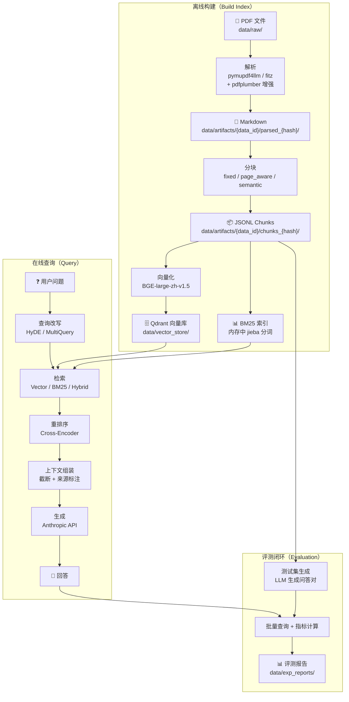

### 1.2 核心模块依赖关系

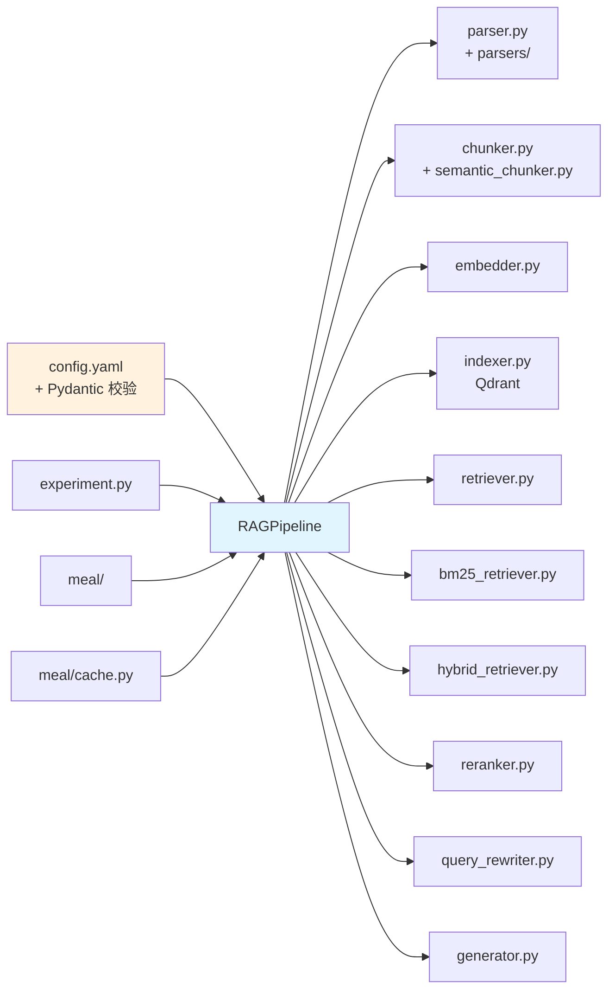

### 1.3 数据格式流转一览

| 阶段 | 输入格式 | 输出格式 | 持久化位置 |
|------|---------|---------|-----------|
| 解析 | `.pdf` 二进制 | `.md` / `.pages.json` | `data/artifacts/{data_id}/parsed_{hash}/` |
| 分块 | `.md` / `.pages.json` | `.jsonl`（每行一个 chunk） | `data/artifacts/{data_id}/chunks_{hash}/` |
| 向量化 | chunk 文本 | `ndarray(N, 1024)` | 内存 → Qdrant |
| 索引 | chunk + embedding | Qdrant Points | `data/vector_store/` |
| BM25 | chunk 文本 | 分词 + IDF 字典 | 内存（无持久化） |
| 查询 | 字符串 | `dict{question, answer, contexts, ...}` | 不持久化 |
| 评测 | 测试集 JSON | 指标 dict | `data/exp_reports/` |

---

## 2. 阶段一：PDF 解析（Parse）

### 2.1 解析管线架构

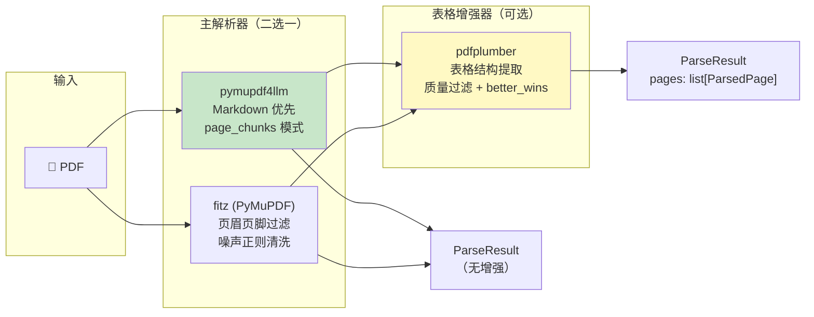

### 2.2 关键设计：组合解析器模式

系统采用 **主解析器 + 增强器** 的组合模式，而非单一解析器：

- **主解析器**（`ParserRegistry.get()`）：负责全文提取，输出 `ParseResult`
- **增强器**（`ParserRegistry.get_enhancer()`）：对主解析器的输出做二次加工（如表格格式改善）
- **组合解析器**（`CompositeParser`）：编排两者的执行顺序

这种设计的好处是：可以独立替换主解析器或增强器，而不影响另一端。例如，从 pymupdf4llm 切换到 fitz 时，表格增强器无需修改。

### 2.3 Artifact Cache 与内容寻址

解析结果不是随意存放的，而是通过 **内容寻址** 确定路径：

```
data/artifacts/{data_id}/parsed_{parser_hash}/
```

- `data_id` = SHA-256(所有 PDF 文件的 SHA-256 列表) → 数据变了，路径就变
- `parser_hash` = SHA-256(解析算法 + 参数) → 配置变了，路径就变

这意味着：**同样的数据 + 同样的配置，一定命中同一个缓存目录**。这是后端层面非常优秀的设计——天然实现了构建缓存。

### 2.4 数据流细节

```python
# 伪代码：parse_all_pdfs_unified 的核心逻辑
for pdf_path in raw_dir.rglob("*.pdf"):
    result = parse_pdf(
        pdf_path,
        parser_name="pymupdf4llm",       # 主解析器
        enhancer_name="pdfplumber",       # 表格增强
        parser_options={...},             # page_chunks=True 等
        enhancer_options={...},           # table_settings 等
    )
    # result = ParseResult(pages=[ParsedPage(page_number, text, metadata)], metadata={source: ...})

    # 持久化：每个 PDF 输出一个 .md 文件（全文拼接）或 .pages.json（按页）
    if page_chunks_mode:
        save as .pages.json  # 保留页边界信息
    else:
        save as .md          # 纯文本
```

---

## 3. 阶段二：文本分块（Chunk）

### 3.1 三种分块策略

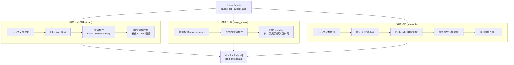

### 3.2 关键设计：字符偏移映射

这是一个解决实际 Bug 的精巧设计。问题场景：

```
原始文本: "贵州茅台2023年营收1234亿元"
Token化:  ["贵州", "茅台", "2023", "年", "营收", "1234", "亿元"]
```

如果直接用 `tokenizer.decode(tokens[start:end])` 来提取子串，在 UTF-8 多字节字符的边界处可能截断，产生乱码。解决方案是构建 **token 索引 → 字符偏移** 的映射表，然后从原始文本中直接截取子串：

```python
# chunker.py 核心逻辑
offsets = _build_token_char_offsets(encoding, tokens, text)
# offsets[i] = (char_start, char_end) for token i
chunk_text = text[offsets[start][0] : offsets[end-1][1]]
```

### 3.3 BGE Tokenizer 对齐

分块使用的 tokenizer 可以选择 `bge`（与 Embedder 对齐）或 `cl100k_base`（tiktoken）。选择 `bge` 意味着分块的 token 计数与嵌入模型的 token 计数完全一致，避免了"分块说 512 token，但嵌入模型实际吃了 480 token"的偏差。

### 3.4 输出格式

每个 chunk 是一个 JSON 对象，写入 `.jsonl` 文件（每行一个）：

```json
{
  "chunk_id": "贵州茅台2023年年度报告_page3_chunk0",
  "text": "2023年，公司实现营业收入...",
  "metadata": {
    "source": "annual_reports/贵州茅台2023年年度报告.md",
    "page_number": 3,
    "chunk_index": 0,
    "token_count": 512,
    "char_count": 1024
  }
}
```

---

## 4. 阶段三：向量化与索引（Embed & Index）

### 4.1 向量化流程

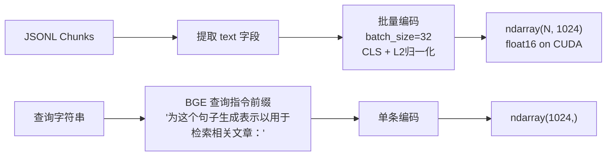

### 4.2 Embedder 的设计要点

- **查询指令自动检测**：BGE 模型需要查询前缀，系统自动识别模型名中含 `bge` 就加上，非 BGE 模型不加
- **CUDA 自动降级**：`device="cuda"` 时检测 CUDA 可用性，不可用则降级到 CPU
- **FP16 半精度**：CUDA 模式下自动使用 FP16，减少显存占用
- **Tokenizer 全局缓存**：`_tokenizer_cache` 类变量避免重复加载
- **模型卸载**：`unload()` 方法显式释放模型权重 + `torch.cuda.empty_cache()`

### 4.3 Qdrant 索引构建

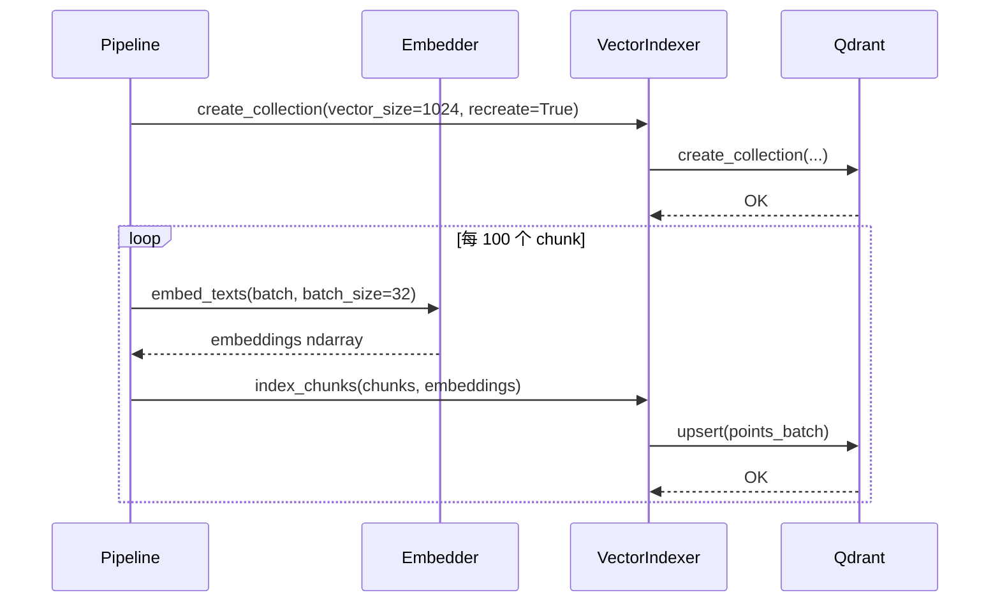

### 4.4 增量更新机制

系统支持按 source（文档来源）做增量更新：

1. `indexer.delete_by_source(source)` — 删除该文档的所有向量
2. `indexer.upsert_chunks(new_chunks, new_embeddings)` — 用 UUID 作为 point ID 插入新向量

这比全量重建轻量得多，适合单文档更新的场景。

### 4.5 BM25 稀疏索引

BM25 索引是纯内存的，不持久化：

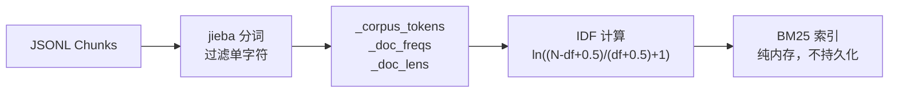

**后端视角的问题**：BM25 索引每次重启都要重建，对于大规模数据集（数千文档）会有明显的启动延迟。这是一个已知的架构债务。

---

## 5. 阶段四：查询管线（Query Pipeline）

### 5.1 查询全流程

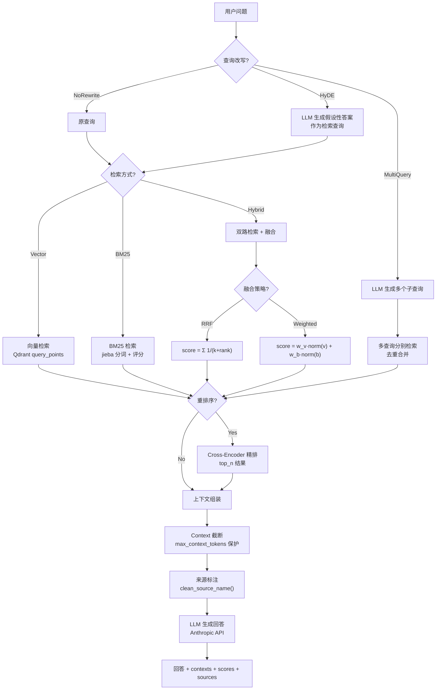

### 5.2 策略模式的应用

查询管线中有两处使用了策略模式：

**检索策略**（`retrieval_strategies.py`）：

```python
class RetrievalStrategy(ABC):
    def retrieve(self, query, top_k) -> RetrievalResult: ...

class VectorRetrievalStrategy(RetrievalStrategy): ...
class BM25RetrievalStrategy(RetrievalStrategy): ...
class HybridRetrievalStrategy(RetrievalStrategy): ...
```

**查询改写策略**（`query_rewrite_strategies.py`）：

```python
class QueryRewriteStrategy(ABC):
    def rewrite(self, query) -> RewrittenQuery: ...

class NoRewriteStrategy(QueryRewriteStrategy): ...
class HyDERewriteStrategy(QueryRewriteStrategy): ...
class MultiQueryRewriteStrategy(QueryRewriteStrategy): ...
```

策略模式的好处是：`pipeline.query()` 方法不需要知道具体使用哪种检索或改写方式，只通过统一接口调用。新增策略时无需修改管线代码。

### 5.3 Config Hot-Swap 机制

`query()` 方法接受 `config_overrides` 参数，可以在单次查询中覆盖配置：

```python
result = pipeline.query(
    "贵州茅台2023年营收多少？",
    config_overrides={
        "retrieval": {
            "method": "hybrid",
            "reranker": {"enabled": True}
        }
    }
)
```

内部通过 `deep_merge(base_config, config_overrides)` 实现。这意味着**不需要重新初始化管线就能实验不同参数**——这对实验系统至关重要。

### 5.4 懒加载设计

重型资源（Reranker、BM25 索引、Query Rewriter）都采用懒加载：

```python
def _ensure_reranker(self):
    if self.reranker is not None:
        return
    # 首次使用时才加载 Cross-Encoder 模型（~1.3GB）
    self.reranker = Reranker(...)

def _ensure_bm25_index(self):
    if self.bm25_retriever.is_indexed():
        return
    # 首次使用时才从 JSONL 构建 BM25 索引
    self.bm25_retriever.build_index_from_chunks(...)
```

这避免了"只做向量检索却加载了 Reranker 模型"的资源浪费。

### 5.5 Context Window 保护

`Generator._truncate_contexts()` 方法确保输入不超过模型的 context window：

```
max_context_tokens (8000)
  = system_prompt tokens
  + contexts tokens (截断到 fit)
  + query tokens
  + max_tokens (输出预留)
  + safety_buffer (200)
```

从尾部逐个移除 context chunk，直到总 token 数在预算内。这是一个防御性设计，防止 API 调用因超长输入而报错。

### 5.6 管线追踪（Tracing）

当 `capture_trace=True` 时，查询管线会记录每一步的详细数据：

```python
trace = PipelineTrace(trace_id="trace_20260521_143000_4287", question="...")
trace.steps = [
    TraceStep(stage="query_rewrite", duration_ms=1200, ...),
    TraceStep(stage="retrieval", duration_ms=350, ...),
    TraceStep(stage="rerank", duration_ms=800, ...),
    TraceStep(stage="context_assembly", duration_ms=5, ...),
    TraceStep(stage="generation", duration_ms=2100, ...),
]
```

这为 Bad Case 诊断提供了数据基础——可以精确定位"是检索没找到，还是生成跑偏了"。

---

## 6. 阶段五：评测系统（Evaluation）

### 6.1 评测数据流

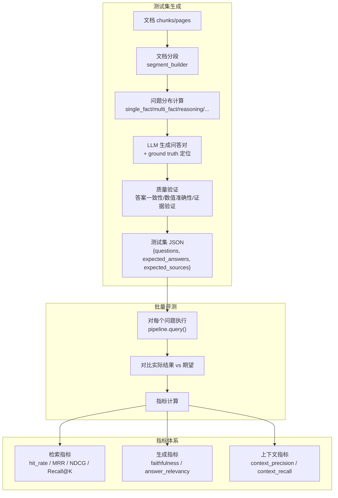

### 6.2 双后端评测

系统支持 `builtin` 和 `ragas` 两个评测后端：

- **builtin**：自研的轻量级评测，使用字符 bigram 重叠 + LLM 辅助验证
- **ragas**：使用 RAGAS 框架的标准评测，需要额外的 LLM 调用

通过 `resolution_strategy` 控制双后端的行为：
- `priority_fallback`：每个指标只由最高优先级后端计算（省 token）
- `comparison`：所有后端都计算，用于对标验证

### 6.3 测试集管理

测试集有独立的管理系统（`testset_cli/`），支持：
- `generate`：生成新测试集
- `compose`：组合多个测试集
- `enrich`：补充 ground truth
- `review`：AI 辅助审查
- `approve`：审批通过
- `migrate`：格式迁移

---

## 7. 阶段六：实验管理（Experiment）

### 7.1 实验执行流程

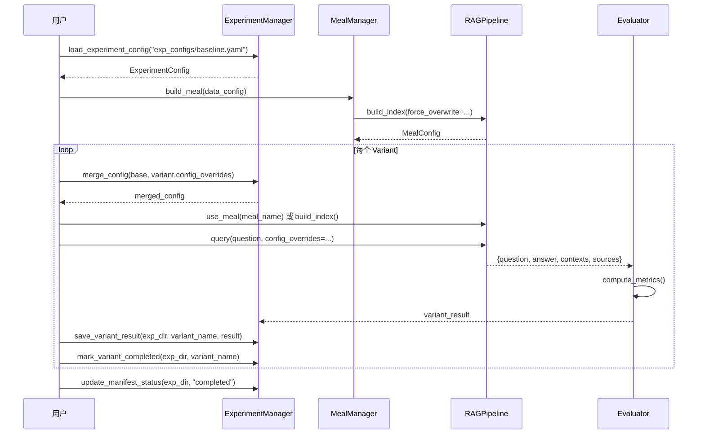

### 7.2 实验目录结构

```
data/exp_reports/exp_20260521_143000_baseline/
├── manifest.json              # 实验元数据 + 进度
├── config_snapshot.yaml       # 合并后的完整配置快照
├── meal_snapshot.json         # Meal 数据快照
├── test_sets/                 # 测试集快照
│   └── document_level_n20.json
└── results/                   # 各变体结果
    ├── baseline.json
    ├── with_reranker.json
    └── with_hybrid.json
```

### 7.3 断点续传

实验支持断点续传（`ResumeConfig`）：

1. `manifest.json` 中的 `completed_variants` 记录已完成的变体
2. `variant_config_hashes` 记录每个变体的配置哈希
3. 续传时跳过已完成的变体；如果配置哈希变了则强制重跑

这是一个对长时间运行的实验非常关键的后端设计——没有它，一次 API 限流导致的失败就可能浪费数小时的 token 消耗。

### 7.4 报告复用

`ReportReuseConfig` 支持三种模式：
- `none`：每次全新运行
- `in_place`：在已有实验目录中增补新变体（自动备份）
- `copy_migrate`：复制已有实验到新目录，然后增补

---

## 8. 支撑系统：Meal、Artifact Cache、配置

### 8.1 Meal 系统

Meal 是"数据 + 配置 + 索引"的快照包，核心思想是 **数据不可变 + 配置可变**：

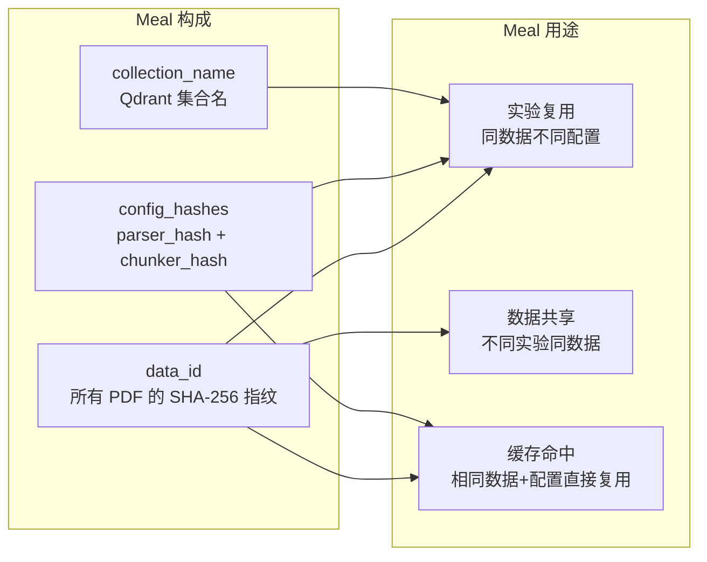

**关键公式**：
- `data_id = SHA-256(sorted([SHA-256(pdf) for pdf in all_pdfs]))`
- `parser_hash = SHA-256(algorithm + options)`
- `chunker_hash = SHA-256(chunk_size + overlap + encoding)`
- `collection_name = "m_" + data_id[:12]`

### 8.2 Artifact Cache

Artifact Cache 是内容寻址的文件存储：

```
data/artifacts/
├── {data_id_16chars}/
│   ├── parsed_{parser_hash_12chars}/
│   │   ├── 贵州茅台2023年年度报告.md
│   │   └── 贵州茅台2023年年度报告.pages.json
│   └── chunks_{chunker_hash_12chars}/
│       ├── 贵州茅台2023年年度报告.jsonl
│       └── ...
└── _pointers/
    ├── full_parsed.pointer    → "abc123456789def0/parsed_123456789abc"
    └── full_chunks.pointer    → "abc123456789def0/chunks_987654321abc"
```

`_pointers/` 目录存储"当前完整数据集"的路径指针，避免每次都要遍历所有哈希目录。

### 8.3 配置系统

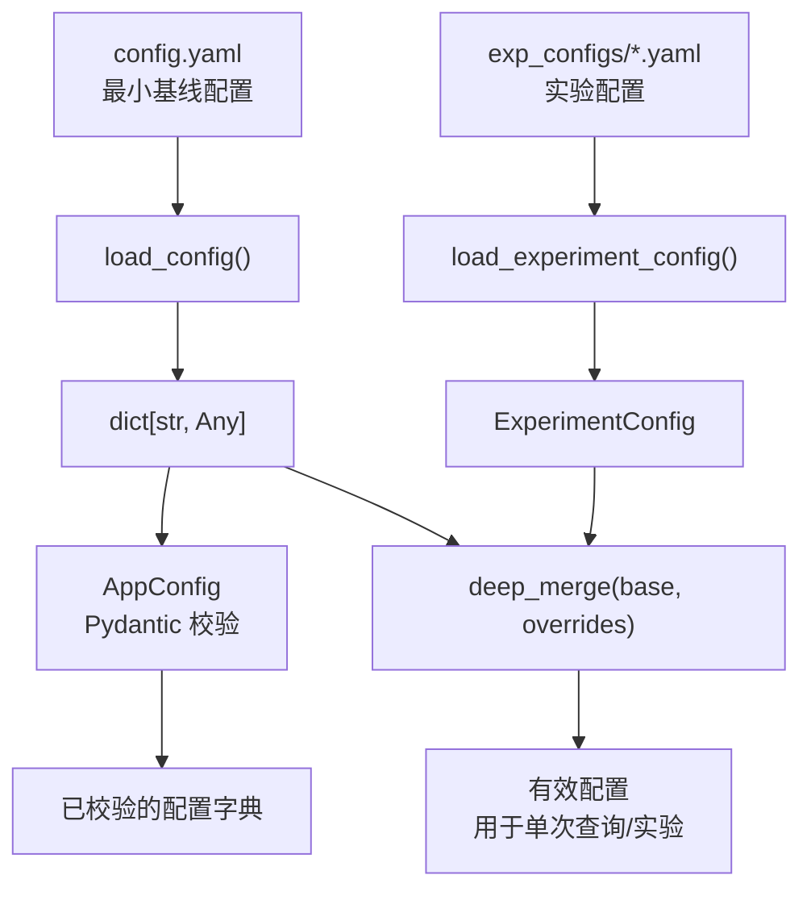

配置系统的核心设计是 **基线 + 覆盖**：
- `config.yaml` 定义最小基线（纯向量检索，无优化）
- 实验配置通过 `config_overrides` 覆盖基线的部分字段
- `deep_merge()` 递归合并，只覆盖指定的键

Pydantic 模型（`AppConfig`）提供编译时类型检查和运行时范围校验，但运行时仍然传递 `dict`——这是一个类型安全的妥协。

---

## 9. 后端架构审视：设计得好的地方

### 9.1 内容寻址缓存 ✅

Artifact Cache 使用 `data_id + config_hash` 作为路径，天然实现了构建缓存。同样的数据 + 同样的配置，一定命中同一个缓存目录。这是后端领域"不可变 artifact"思想的体现，类似于 Docker 的 layer cache 或 Bazel 的 remote cache。

**为什么好**：
- 避免重复计算（解析和分块都是 CPU 密集型操作）
- 实验之间自动共享中间产物
- 配置变了自动失效，不会用过期数据

### 9.2 策略模式 ✅

检索策略和查询改写策略都使用了策略模式，新增策略时无需修改管线代码。这符合开闭原则（OCP）。

**为什么好**：
- 新增 HyDE 策略时，不需要修改 `pipeline.py`
- 实验系统可以通过 `config_overrides` 切换策略，无需代码变更
- 单元测试可以 mock 策略，隔离测试

### 9.3 懒加载重型资源 ✅

Reranker（~1.3GB）、BM25 索引、Query Rewriter 都采用懒加载。只在首次使用时才初始化。

**为什么好**：
- 纯向量检索场景不浪费内存加载 Reranker
- 启动速度快（不需要等待所有模型加载）
- 资源按需分配

### 9.4 Config Hot-Swap ✅

`query()` 方法接受 `config_overrides`，可以在不重新初始化管线的情况下实验不同参数。这对实验系统至关重要——否则每个变体都要重建管线，开销巨大。

### 9.5 自定义异常体系 ✅

```python
RAGPipelineError
├── ConfigurationError
├── ParsingError
├── RetrievalError
├── IndexingError
├── GenerationError
├── MealError
├── TestSetError
├── EvaluationError
└── ReuseError
    ├── FingerprintMismatchError
    └── ConflictDetectedError
```

清晰的异常层级让调用方可以精确捕获特定类型的错误，而不是笼统地 `except Exception`。

### 9.6 断点续传 ✅

实验系统通过 `manifest.json` 记录已完成的变体和配置哈希，支持断点续传。对于可能运行数小时的评测实验，这是必需品而非奢侈品。

### 9.7 Token 追踪与成本意识 ✅

`TokenTracker` + `DetailedTokenUsage` 精确记录每次 LLM 调用的 token 消耗，并支持按模型计算成本。这是生产级 RAG 系统的标配——不知道成本就无法优化成本。

### 9.8 管线追踪（Tracing）✅

`PipelineTrace` + `TraceStep` 记录查询管线的每一步耗时和数据，为 Bad Case 诊断提供了数据基础。这是可观测性（Observability）的基本要求。

### 9.9 LLM 重试与指数退避 ✅

`call_with_retry()` 实现了指数退避 + 抖动的重试机制，专门处理 429/503/529 等限流错误。这是调用外部 API 的最佳实践。

### 9.10 共享 Embedder ✅

实验系统中，多个变体共享同一个 Embedder 实例（~1.3GB 显存），通过 `embedder` 参数注入。这避免了 N 个变体 × 1.3GB 的显存浪费。

---

## 10. 后端架构审视：可以改进的地方

### 10.1 RAGPipeline 是 God Class ⚠️

**现状**：`pipeline.py` 有 1077 行，承担了初始化、索引构建、查询执行、资源管理、并发克隆等职责。

**问题**：
- 违反单一职责原则（SRP）
- 任何修改都有较高的回归风险
- 难以独立测试各职责

**建议**：拆分为：
- `PipelineBuilder`：负责初始化和组件组装
- `IndexService`：负责 `build_index()` 相关逻辑
- `QueryService`：负责 `query()` 相关逻辑
- `PipelineResources`：负责资源生命周期管理

### 10.2 运行时配置仍是 Dict ⚠️

**现状**：Pydantic 模型（`AppConfig`）仅用于启动时校验，运行时传递的是 `dict[str, Any]`。

**问题**：
- 丢失了类型安全——IDE 无法推断 `config["retrieval"]["top_k"]` 的类型
- 拼写错误只能在运行时发现
- 函数签名无法表达配置的结构

**建议**：在关键路径上使用 Pydantic 模型而非 dict。可以渐进式迁移，从 `RetrievalConfig` 开始。

### 10.3 BM25 索引无持久化 ⚠️

**现状**：BM25 索引纯内存，每次重启都要从 JSONL 重建。

**问题**：
- 大数据集启动慢（数千文档 × jieba 分词）
- 内存占用无上限控制
- 不符合"持久化中间产物"的项目规范

**建议**：
- 短期：将 BM25 索引序列化到 `data/artifacts/` 下，启动时直接加载
- 长期：考虑使用 Elasticsearch 或 Qdrant 的全文检索功能替代自实现 BM25

### 10.4 缺少依赖注入 ⚠️

**现状**：组件在 `RAGPipeline.__init__()` 内部创建，而非外部注入。

```python
# 当前：内部创建
self.embedder = Embedder(model_name=..., device=...)
self.indexer = VectorIndexer(persist_dir=..., collection_name=...)
self.generator = Generator(model_name=..., api_key=..., ...)
```

**问题**：
- 单元测试困难——无法 mock 外部依赖
- 组件生命周期耦合在 Pipeline 中

**建议**：采用构造器注入，通过工厂函数或 DI 容器组装：

```python
# 建议：外部注入
pipeline = RAGPipeline(
    embedder=embedder,
    indexer=indexer,
    generator=generator,
    ...
)
```

### 10.5 ExperimentManager 直接操作文件 I/O ⚠️

**现状**：`ExperimentManager` 直接读写 JSON/YAML 文件，没有存储抽象层。

**问题**：
- 无法替换存储后端（如迁移到数据库）
- 文件操作的错误处理分散在各方法中
- 并发写入可能导致数据损坏

**建议**：引入 Repository 抽象：

```python
class ExperimentRepository(ABC):
    def save_manifest(self, exp_id, manifest) -> None: ...
    def load_manifest(self, exp_id) -> dict: ...
    def save_variant_result(self, exp_id, variant_name, result) -> None: ...
    def load_variant_result(self, exp_id, variant_name) -> dict | None: ...
```

### 10.6 无异步支持 ⚠️

**现状**：所有 I/O 操作都是同步的（Qdrant 查询、LLM API 调用、文件读写）。

**问题**：
- 并发评测通过线程池实现，但 Python GIL 限制了 CPU 密集型操作的并行度
- LLM API 调用是 I/O 密集型，天然适合 async/await
- `concurrent_queries=10` 的并发度受限于线程切换开销

**建议**：
- 短期：保持同步 API，但确保 LLM 调用在独立线程中执行
- 长期：将 LLM 调用和 Qdrant 查询迁移到 async，使用 `asyncio.gather()` 实现真正并发

### 10.7 无断路器（Circuit Breaker）⚠️

**现状**：LLM 调用有重试机制，但没有断路器。

**问题**：
- 如果 API 持续故障，重试会持续消耗时间和 token
- 没有快速失败（fail-fast）机制
- 大规模评测时，一个 API 故障可能导致整个实验卡住

**建议**：在 `call_with_retry` 之上增加断路器：

```python
circuit_breaker = CircuitBreaker(
    failure_threshold=5,    # 连续 5 次失败后断开
    recovery_timeout=60,    # 60 秒后尝试恢复
)
```

### 10.8 build_index 方法职责过重 ⚠️

**现状**：`RAGPipeline.build_index()` 有 200+ 行，直接操作文件系统、计算哈希、管理缓存指针。

**问题**：
- 与 Artifact Cache 的逻辑深度耦合
- 采样逻辑（`sampling_config`）穿插在主流程中
- 难以单独测试缓存逻辑

**建议**：将缓存管理逻辑提取到 `ArtifactCache` 中，`build_index` 只负责编排：

```python
def build_index(self, ...):
    parsed_dir = self.cache.get_or_parse(data_id, parser_hash, ...)
    chunks_dir = self.cache.get_or_chunk(data_id, chunker_hash, parsed_dir, ...)
    self._index_chunks(chunks_dir, ...)
```

### 10.9 缺少结构化日志 ⚠️

**现状**：使用 `loguru` 的文本日志，关键指标（如检索耗时、token 消耗）散落在日志文本中。

**问题**：
- 无法高效聚合分析（如"P50 检索耗时是多少？"）
- 日志格式变更可能导致解析失败
- 缺少 trace_id 关联

**建议**：对关键指标使用结构化日志：

```python
logger.bind(
    trace_id=trace.trace_id,
    stage="retrieval",
    duration_ms=350,
    result_count=5,
).info("Retrieval completed")
```

### 10.10 Qdrant 客户端无连接池 ⚠️

**现状**：每个 `VectorIndexer` 实例创建独立的 Qdrant 客户端。

**问题**：
- 实验系统中多个变体共享同一个 Qdrant 实例，但创建了多个客户端
- 没有连接复用

**建议**：使用 Qdrant 客户端单例或连接池，通过 `collection_name` 区分不同数据集。

---

## 11. 改进路线图建议

按优先级排序，兼顾投入产出比：

### P0：必须做（影响正确性或可靠性）

| 编号 | 改进项 | 理由 |
|------|--------|------|
| 1 | BM25 索引持久化 | 大数据集启动慢，违反"持久化中间产物"规范 |
| 2 | 断路器 | API 持续故障时保护系统不卡死 |

### P1：应该做（影响可维护性和开发效率）

| 编号 | 改进项 | 理由 |
|------|--------|------|
| 3 | 拆分 RAGPipeline | God Class 是技术债的根源 |
| 4 | 依赖注入 | 提升可测试性 |
| 5 | build_index 职责拆分 | 降低缓存逻辑的耦合度 |
| 6 | ExperimentRepository 抽象 | 为未来存储后端迁移留路 |

### P2：可以做（提升工程质量）

| 编号 | 改进项 | 理由 |
|------|--------|------|
| 7 | 运行时配置类型化 | 提升类型安全和 IDE 支持 |
| 8 | 结构化日志 | 提升可观测性 |
| 9 | Qdrant 客户端复用 | 减少资源浪费 |
| 10 | 异步支持 | 提升并发评测吞吐量 |

---

## 附录 A：关键文件索引

| 文件 | 职责 | 行数 |
|------|------|------|
| `src/pipeline.py` | RAG 管线主类 | ~1077 |
| `src/parser.py` | PDF 解析入口 | ~200 |
| `src/parsers/` | 解析器实现（pymupdf4llm/fitz/pdfplumber） | ~800 |
| `src/chunker.py` | 固定大小分块 | ~400 |
| `src/semantic_chunker.py` | 语义分块 | ~300 |
| `src/embedder.py` | 向量化 | ~280 |
| `src/indexer.py` | Qdrant 索引管理 | ~530 |
| `src/retriever.py` | 向量检索 | ~100 |
| `src/bm25_retriever.py` | BM25 检索 | ~250 |
| `src/hybrid_retriever.py` | 混合检索 | ~200 |
| `src/reranker.py` | 重排序 | ~150 |
| `src/generator.py` | LLM 生成 | ~340 |
| `src/experiment.py` | 实验管理 | ~1150 |
| `src/config_schema.py` | Pydantic 配置校验 | ~920 |
| `src/exceptions.py` | 自定义异常 | ~75 |
| `src/llm_client.py` | LLM 客户端抽象 | ~80 |
| `src/llm_retry.py` | 重试机制 | ~80 |
| `src/trace_models.py` | 追踪数据模型 | ~200 |
| `src/meal/` | Meal 数据管理 | ~600 |
| `src/core/ops/` | 原子化管线操作 | ~400 |

## 附录 B：配置项与数据流的映射

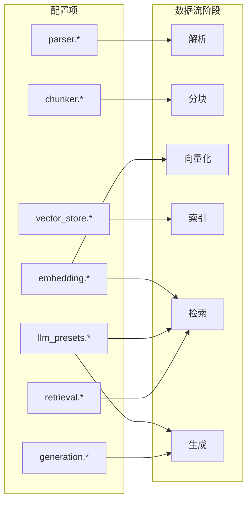
